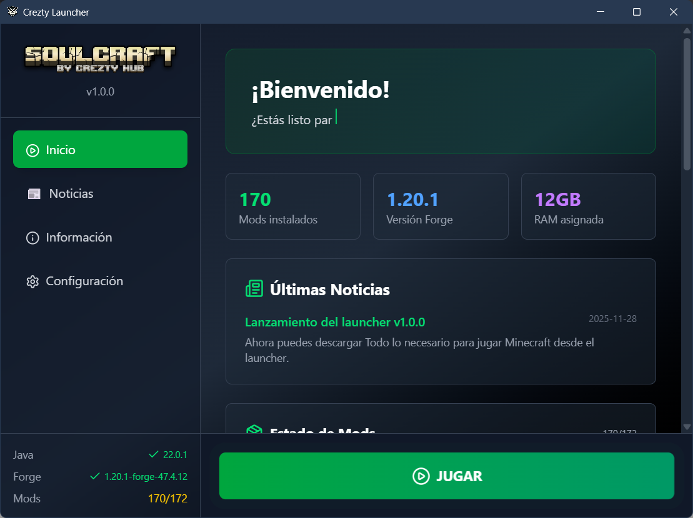

# CreztY Minecraft Launcher

Un launcher de Minecraft personalizado y moderno construido con Electron y React. Diseñado para simplificar la gestión de mods, la configuración de Java y la optimización del juego.



## Características Principales

- **Gestión Automática de Mods**:
  - Descarga y actualización automática de mods desde una fuente centralizada.
  - Verificación de integridad (MD5/SHA256) para detectar archivos corruptos o modificados.
  - Sistema de **Lista Negra (Blacklist)**: Permite a los usuarios omitir mods opcionales, shaders o gráficos que no deseen, persistiendo esta elección entre sesiones.
- **Detección y Gestión de Java**:
  - Verifica si Java está instalado y si la versión es compatible.
  - Ayuda a la descarga del JDK necesario si es necesario.
- **Instalación de Forge**:
  - Detecta y descarga la versión correcta de Forge automáticamente.
- **Optimización y Configuración**:
  - Selector de memoria RAM asignada.
  - **Presets de Shaders**: Configuración rápida de shaders (Bajo, Medio, Alto, Ultra) que selecciona automáticamente el shaderpack adecuado.
  - Niveles de Gráficos predefinidos.
- **Interfaz Moderna**:
  - Diseño fluido con animaciones (Framer Motion).
  - Notificaciones visuales (Toasts) para el estado de las operaciones.
  - Barra de progreso detallada durante la descarga de mods.
- **Actualizaciones Automáticas**:
  - El launcher se actualiza a sí mismo automáticamente utilizando GitHub Releases.

## Instalación y Uso (Usuario Final)

1.  Descarga la última versión (`.exe`) desde la sección de [Releases](https://github.com/CreztY/Minecraft-Launcher/releases).
2.  Ejecuta el instalador.
3.  Al abrir el launcher Haz clic en Configuración, para seleccionar la cantidad de RAM que deseas asignar al juego, y los mods opcionales que deseas.
4.  Haz clic en **JUGAR** para que te detecte e instale todo lo necesario para iniciar Minecraft.

## Configuración (Desarrollador/Mantenedor)

La configuración principal de los mods y el juego se encuentra en `src/config/index.js`.

### Añadir o Quitar Mods

Edita las listas en `src/config/index.js`:

- `RECOMMENDED_MODS`: Mods obligatorios que siempre se descargarán.
- `OPTIONAL_MODS`: Mods que el usuario puede elegir omitir (aunque por defecto se descargan).
- `GRAPHICS_LEVEL_MODS`: Mods específicos para ciertos niveles de gráficos.

**Formato de un mod:**

```javascript
{
  id: 'nombre-unico',
  filename: 'archivo-del-mod.jar',
  name: 'Nombre Visible',
  description: 'Descripción corta para el tooltip.',
  version: '1.0.0',
  hash: null // Opcional: hash para verificación estricta
}
```

### Cambiar la URL de Descarga

Modifica la constante `MODS_SHARE` en `src/config/index.js` para apuntar a tu servidor o carpeta compartida donde se alojan los archivos `.jar`.

## Desarrollo

### Requisitos

- Node.js (v18 o superior recomendado)
- NPM

### Comandos

```bash
# Instalar dependencias
npm install

# Iniciar en modo desarrollo (con Hot Reload)
npm run dev

# Formatear código
npm run format

# Construir para producción (Windows)
npm run build:win
```

### Publicar una Actualización

1.  Sube la versión en `package.json`.
2.  Ejecuta `npm run build:win`.
3.  Crea una nueva Release en GitHub.
4.  Sube el archivo `.exe` generado en `dist/` y el archivo `latest.yml` a la Release.
5.  El launcher detectará la actualización automáticamente.

## Tecnologías

- [Electron](https://www.electronjs.org/)
- [React](https://reactjs.org/)
- [Vite](https://vitejs.dev/)
- [Tailwind CSS](https://tailwindcss.com/)
- [Framer Motion](https://www.framer.com/motion/)
- [Electron Updater](https://www.electron.build/auto-update)
